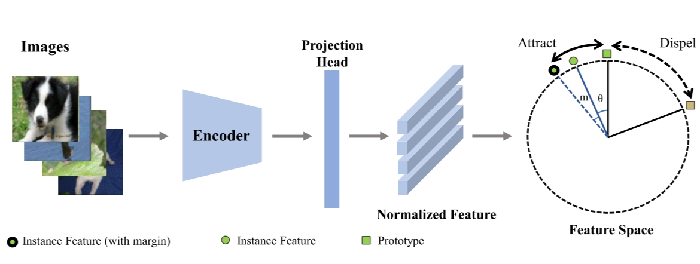

# Improving Out-of-Distribution Detection with Margin-Based Prototype Learning

This repository contains the offical PyTorch implementation of paper:
[Improving Out-of-Distribution Detection with Margin-Based Prototype Learning.](https://link.springer.com/chapter/10.1007/978-981-99-8148-9_12) ICONIP 2023

This code is developed based on the code of [CIDER](https://github.com/deeplearning-wisc/cider), and we appreciate their contributions very much. You can download the datasets and find the directory structure there.
## Overview


We achieve the SOTA on CIFAR-100 and CIFAR-10 benchmark.


## Dependencies
Recommend:
  - python=3.8
  - pytorch=1.8.1
  - torchvision=0.9.1
  - cudatoolkit=10.1

All experiments are conducted on an Nvidia V100 GPU.


## Training

````
sh scripts/train_cifar10.sh
sh scripts/train_cifar100.sh
````

## Evaluation
````
sh scripts/eval_ckpt_cifar10.sh ckpt_c10 #for CIFAR-10 
sh scripts/eval_ckpt_cifar100.sh ckpt_c100 # for CIFAR-100
# ckpt_c10/c100 is checkpoint name, and the checkpoint shold be placed in the right directory.
````
